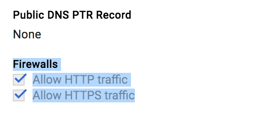

Simple HTTP to HTTPS redirect Server in Go
---

## Installation Instructions for Gcloud
1. Make sure you have the default http port open and accessible from the internet.
In order to check that login to Gcloud Compute and visit the instance page. Make sure the 
**Firewall** rules for http is checked. 
2. Login to your instance.
3. Make a folder inside the **$GOPATH** directory that will host the redirect server
```bash
mkdir -p $GOPATH/redirect-server
cd $GOPATH/redirect-server
```

4. Create a file named `main.go` and copy the following code:
```
package main

import (
	"flag"
	"log"
	"net/http"
	"strings"
	"time"
)

const (
	httpsPort = "443"
	httpPort  = "80"
)

func redirect(w http.ResponseWriter, req *http.Request) {
	// remove/add not default ports from req.Host
	hostNameParts := strings.Split(req.Host, ":")
	target := "https://" + hostNameParts[0] + ":" + httpsPort + req.URL.Path

	if len(req.URL.RawQuery) > 0 {
		target += "?" + req.URL.RawQuery
	}
	log.Printf("redirect to: %s", target)
	http.Redirect(w, req, target, http.StatusTemporaryRedirect)
}

func main() {
	var port string
	flag.StringVar(&port, "port", httpPort, "http port")
	flag.Parse()

	server := &http.Server{
		Addr:           ":" + port,
		ReadTimeout:    10 * time.Second,
		WriteTimeout:   10 * time.Second,
		MaxHeaderBytes: 1 << 16,
		Handler:        http.HandlerFunc(redirect)}

	log.Fatal(server.ListenAndServe())
}
```
 
Alternatively just copy the contents of this folder into your $GOPATH.
```bash
gcloud compute scp instance:~/redirect-server ~/
gcloud compute ssh instance
mv redirect-server $GOPATH/redirect-server
```

5. Run the App as superuser.
```bash
sudo go run main.go
```

6. If everything is ok the navigate to your server IP address using the http prefix and you 
should be redirected to the https equivalent.

## Code Details
* The serve just maps any request from port 80 to port 443.
If you look at the `redirect` handler we need to parse the `hostname:port`
string and keep the hostname part but change the port part.

* Now for the redirect status we use a temporary redirect but you can also use
a `StatusPermanentRedirect`

* The Server comes with custom timeouts to prevent too many lingering connections.

* It is recommended though to replace this server with a proper Proxy server like nginx because:
    1. Its more performant.
    2. Its more declarative.
    3. Its more scalable.
    
* Its recommended to start the server using supervisor or some other production ready process manager.

## Tests
To run the tests just enter the following command:
```
go test
```